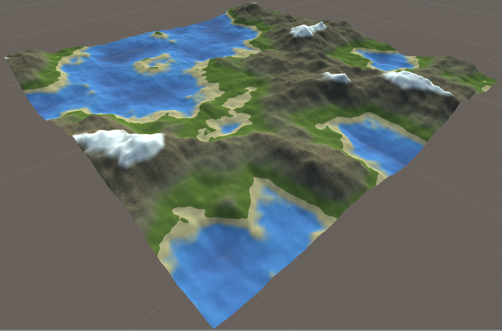

# Procedural-Generation-3D-Terrain-Unity:
It's my final school project. The goal of this one is to generate procedurally a 3D terrain mesh procedurally. We made a customize generator with Unity 3D, you can choose the noise function, and different erosion on the terrain.

# Some Result:

# Author 
Killian Colin (me)
Quentin Garcia

# Main source use:
https://www.youtube.com/watch?v=wbpMiKiSKm8&list=PLFt_AvWsXl0eBW2EiBtl_sxmDtSgZBxB3&index=1

https://catlikecoding.com/unity/tutorials/

https://linuxfr.org/news/je-cree-mon-jeu-video-e10-generation-procedurale-de-carte-partie-1

